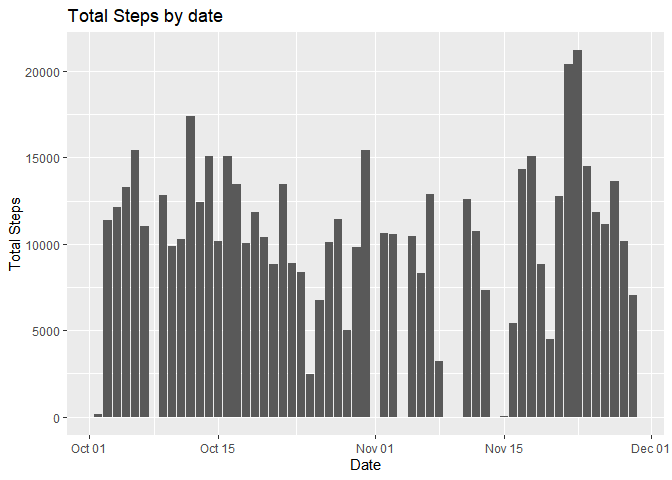
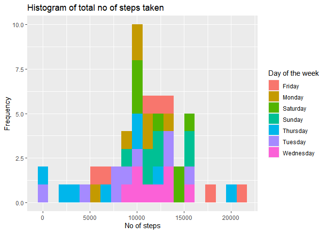
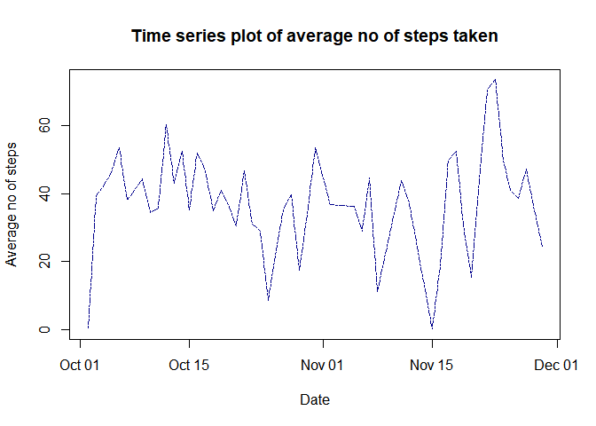
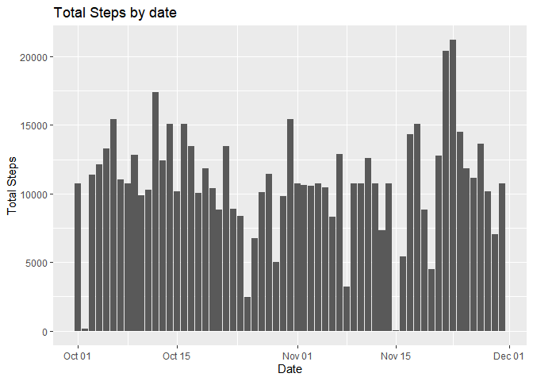
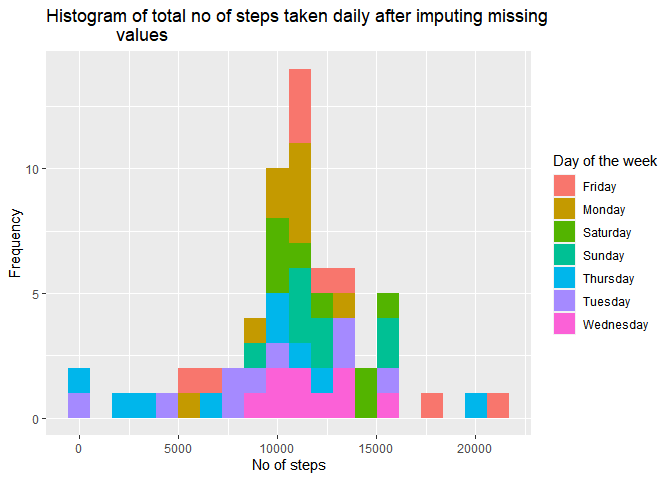
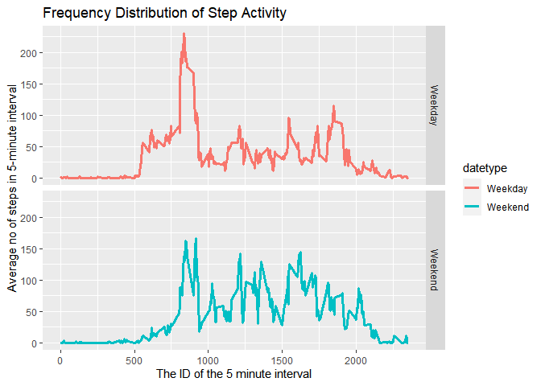

Reproducible Research Assignment 01
-----------------------------------

    library('dplyr')
    library('lubridate')
    library('ggplot2')

1.  *Code for reading in the dataset and/or processing the data*

<!-- -->

    activity_data<-as.data.frame(read.csv("activity.csv", header = T, comment.char = ""))
    head(activity_data)

    ##   steps       date interval
    ## 1    NA 2012-10-01        0
    ## 2    NA 2012-10-01        5
    ## 3    NA 2012-10-01       10
    ## 4    NA 2012-10-01       15
    ## 5    NA 2012-10-01       20
    ## 6    NA 2012-10-01       25

    We can observe NA values in steps so we remove them and change class of attribute date from character to date

    #
    missing_data<-is.na(activity_data$steps)
    complete_activity_data<-activity_data[missing_data==F,]
    complete_activity_data$date<-ymd(complete_activity_data$date)
    head(complete_activity_data)

    ##     steps       date interval
    ## 289     0 2012-10-02        0
    ## 290     0 2012-10-02        5
    ## 291     0 2012-10-02       10
    ## 292     0 2012-10-02       15
    ## 293     0 2012-10-02       20
    ## 294     0 2012-10-02       25

1.  *Histogram of the total number of steps taken each day*

<!-- -->

    aggregate_data<-aggregate(complete_activity_data$step,by =    
                                list(complete_activity_data$date), FUN = sum )
    colnames(aggregate_data)<-c("Date","Total No of Steps")

    ggplot(aggregate_data,aes(y=aggregate_data$`Total No of Steps`,x=aggregate_data$Date))+geom_bar(stat="identity") + ylab("Total Steps")+xlab("Date")+ggtitle("Total Steps by date")

    qplot(aggregate_data$`Total No of Steps`, geom = "histogram", 
          fill=as.factor(weekdays(aggregate_data$Date)), bins =20)+
          ggtitle("Histogram of total no of steps taken ")+
          labs(x="No of steps", y ="Frequency", fill = "Day of the week")

1.  *Mean and median number of steps taken each day*

<!-- -->

    Mean <- round(mean(aggregate_data$`Total No of Steps`), digits = 2)
    Median<-median(aggregate_data$`Total No of Steps`)

Mean no of steps taken each day 1.07661910^{4} Median no of steps taken
each day 10765

1.  *Time series plot of the average number of steps taken*

<!-- -->

    aggregate_data1<-aggregate(complete_activity_data$steps, 
                               by = list(complete_activity_data$date), FUN = mean)
    colnames(aggregate_data1)<-c("Date","Average no of steps taken")
    plot(aggregate_data1,pch =19, main="Time series plot of average no of steps taken", 
         ylab ="Average no of steps", xlab = "Date", type='l', lty=6 , col="darkblue")

1.  *The 5-minute interval that, on average, contains the maximum number
    of steps*

<!-- -->

    aggregate_data2<-aggregate(complete_activity_data$steps, 
                               by = list(complete_activity_data$interval), FUN = mean)
    colnames(aggregate_data2)<-c("Interval","Average no of steps taken")
    aggregate_data2[which.max(aggregate_data2$`Average no of steps taken`),]$Interval

    ## [1] 835

1.  *Code to describe and show a strategy for imputing missing data*

-   We have a total of 2304 missing values all belonging to attribute
    steps
-   First let us see the no of missing values spread over date &
    interval
-   Therefore an imputing strategy must be devised to replace all of
    these missing values with usable numeric measurements. To do so, I
    decided to replace each missing value with the mean value for the
    same interval, averaged across all days. -I used a for loop to
    achieve this, first testing if each observation was an NA value, and
    if so, replacing it with the mean average for that interval, (as
    calculated in a previous question).

<!-- -->

    imputedData <- activity_data
    imputedData$date<-ymd(imputedData$date)

    for(x in 1:17568) {
        if(is.na(imputedData[x, 1])==TRUE) {
            imputedData[x, 1] <- aggregate_data2[aggregate_data2$Interval 
                                                 %in% imputedData[x, 3], 2]
        }
    }

    head(imputedData)

    ##       steps       date interval
    ## 1 1.7169811 2012-10-01        0
    ## 2 0.3396226 2012-10-01        5
    ## 3 0.1320755 2012-10-01       10
    ## 4 0.1509434 2012-10-01       15
    ## 5 0.0754717 2012-10-01       20
    ## 6 2.0943396 2012-10-01       25

1.  *Histogram of the total number of steps taken each day after missing
    values are imputed*

<!-- -->

    aggregate_data4<-aggregate(imputedData$step,
                               by = list(imputedData$date), FUN = sum )
    colnames(aggregate_data4)<-c("Date","Total No of Steps")

    ggplot(aggregate_data4,aes(y=aggregate_data4$`Total No of Steps`,x=aggregate_data4$Date))+geom_bar(stat="identity") + ylab("Total Steps")+xlab("Date")+ggtitle("Total Steps by date")

    qplot(aggregate_data4$`Total No of Steps`, geom = "histogram", 
          fill=as.factor(weekdays(aggregate_data4$Date)), bins =20)+
          ggtitle("Histogram of total no of steps taken daily after imputing missing    
                  values")+
          labs(x="No of steps", y ="Frequency", fill = "Day of the week")

1.  *Panel plot comparing the average number of steps taken per 5-minute
    interval across weekdays and weekends*

<!-- -->

    #Create a new factor variable in the dataset with two levels – “weekday” and “weekend” indicating whether a given date is a weekday or weekend day.
      imputedData$datetype <- sapply(imputedData$date, 
            function(x) {
                    if (weekdays(x) == "Saturday" | weekdays(x) =="Sunday") 
                    {y <- "Weekend"} else 
                    {y <- "Weekday"}
                    y
            })
    head(imputedData)

    ##       steps       date interval datetype
    ## 1 1.7169811 2012-10-01        0  Weekday
    ## 2 0.3396226 2012-10-01        5  Weekday
    ## 3 0.1320755 2012-10-01       10  Weekday
    ## 4 0.1509434 2012-10-01       15  Weekday
    ## 5 0.0754717 2012-10-01       20  Weekday
    ## 6 2.0943396 2012-10-01       25  Weekday

    activityData2Interval <- aggregate(steps ~ interval + datetype, data= imputedData, 
                                       mean)
    ggp <- ggplot(activityData2Interval, aes(interval, steps, colour=datetype)) +
            geom_line(linetype ='solid' , size =1.25) +
            facet_grid(datetype ~ .) +
            labs(title = "Frequency Distribution of Step Activity",
                y="Average no of steps in 5-minute interval",
                x="The ID of the 5 minute interval") 
    print(ggp)

